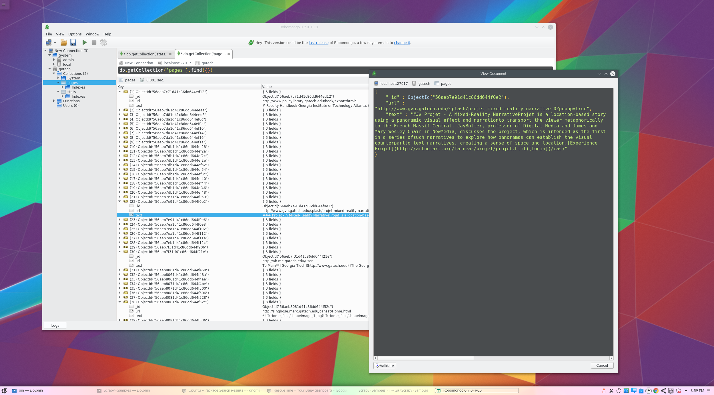

# A crawler based on Scrapy to crawl all pages on one domain

[](https://travis-ci.org/zizhengwu/gatech-crawler)

An easy to deploy crawler which crawls all pages in the domain `gatech.edu` into simple text (JavaScript and CSS is discarded for example).

## Requirements

- Python 2.7.11
- MongoDB

## How to run
Deploy MongoDB at localhost:27017 (which should be default).

```
pip install -r requirements.txt
python main.py
```

That's it! Crawled pages will be stored in the collection `pages` inside database `gatech`.

## Screenshot
